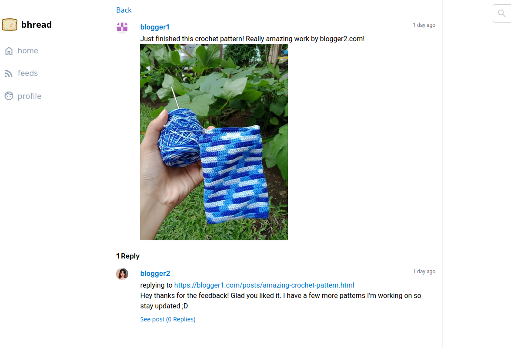

---

### Welcome to the Bhread code repository


[Bhread website](https://bhread.com)
## About bhread

Bhread is the twitter for blogs.

Bhread is a blog aggregator that focuses on connecting blogs to other blogs.
A common pattern for interaction are replies.

Here's how to do it in bhread:

> blogger1.com post (url: https://blogger1.com/posts/amazing-crochet-pattern.html):
```
Just finished this crochet pattern! Really amazing work by blogger2.com!
</img>
```

> blogger2.com post:
```
replying to https://blogger1.com/posts/amazing-crochet-pattern.html

Hey thanks for the feedback! Glad you liked it. I have a few more patterns I'm working on so stay updated ;D
```

Bhread.com will display this interaction in a thread just like twitter:



This is the basic functionality of bhread. If this sounds great to you, head over to bhread.com to join the conversation.

To learn more, [visit the Bhread blog.](https://blog.bhread.com)
More features are on the way. Stay updated by subscribing to the rss feed.


## Code

We follow most of [HackSoftware/Django-Styleguide](https://github.com/HackSoftware/Django-Styleguide)
This means that we try to have thin models, no signals, use selectors and services.

Django is the backend server with plugins:

- Djangoq - managing async tasks and schedules
- slippers - creating components NOTE: By default, [Slippers]() are loaded to every template.
- django-tailwind - easy tailwind use inside templates

For backend and frontend connectivity, [htmx](https://htmx.org) is used.

For styling, Bhread uses [Tailwind]() and is heavily inspired (literal copy) by
[Water.css](https://watercss.kognise.dev/) style.

For client scripting, alpine.js is used.

The [bhread diagram](./bhread.drawio) contains an ERD, and some flow diagrams.
Threads are stored in a tree structure.

## Running the program

The recommended way of development is to use docker.

### These are the steps for development using docker:

Run docker compose:
```sh
docker compose --profile dev up --build
```
or
```sh
docker compose --profile dev up
```


### These are the steps for development without docker, using python poetry:

```sh
poetry install
```

```sh
poetry run python3 manage.py runserver 0.0.0.0:8000
```

Install pre-commit in a new repo:

```sh
poetry run pre-commit install
```
or Run pre-commit in a new repo:
```sh
poetry run pre-commit run --all-files
```

Run redis docker image:

```sh
docker run -p 6379:6379 -it redis/redis-stack:latest
```

Run django-q
```sh
poetry run manage.py qcluster
```

Run tailwind:
```sh
poetry run manage.py tailwind start
```

Run django:
```sh
poetry run manage.py runserver
```

Run Dockerfile:
```sh
docker build -t testing-bhread .
docker run -p 127.0.0.1:8000:8000 testing-bhread
```

(Initial deployment)
Obtain an initial ssl certificate:

```sh
sudo ./init-letsencrypt.sh
```

Renewals are handled by the certbot image in docker.

## management commands

python3 manage.py makeschedules -> adds a schedule for updating feeds every minute

## Custom filters and tags

Filters:

- url_domain: Get domain name of a url

## Contribute

Improvements in code or art submissions (see art/memes) are welcome!
Simply fork this repo, and make a pull request.


## Credits

- Feed parser
- Water.css - Initial prototyping, color scheme
- Django Tailwind - easy-to-use tailwind for django
- https://github.com/PyHAT-stack/awesome-python-htmx
- elk.zone - UI inspiration
- bellybells.net - Crochet photo
- Diff.blog

## Style Guide

1. Do EVERYTHING in the view.

If it's a simple call, you can access it in the template. But anything more than that should be done in the view and passed into the template.

This makes it easy to handle complex logic and keeps the template clean.

2. Database writes should go to services.py, database reads should go to selectors.py

The rest is handled by the views


3. No model methods. Use services instead.
